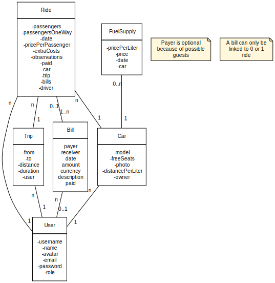

# Go Uni Server

Sanity based server for a university ride app. 

## Class Diagram

## Sanity Docs:

- [Read “getting started” in the docs](https://www.sanity.io/docs/introduction/getting-started?utm_source=readme)
- [Join the community Slack](https://slack.sanity.io/?utm_source=readme)
- [Extend and build plugins](https://www.sanity.io/docs/content-studio/extending?utm_source=readme)
